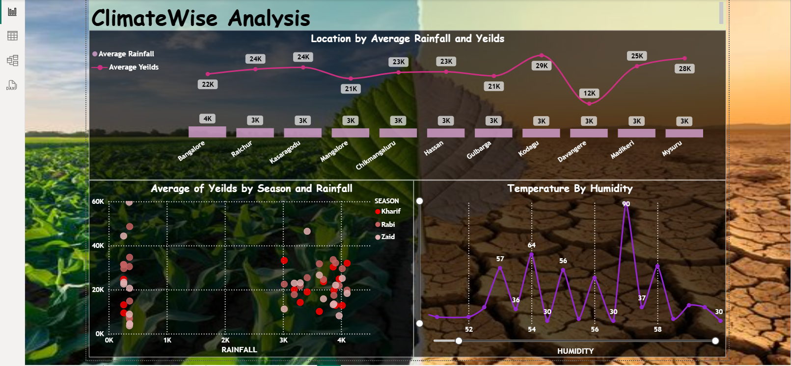

# Agriculture data Analysis

### Dashboards Used:
- ClimateWise Analysis Dashboard
- YieldWise Analysis Dashboard

---

## Problem Statement

This project focuses on analysing agricultural patterns based on climate & yield attributes.  
Using AWS S3 → Snowflake Integration → Power BI, we constructed dynamic visual dashboards to identify trend patterns such as seasonal yields, rainfall behaviour, humidity vs temperature variations & crop performance.

This solution supports agriculture departments, government policy planning, and crop forecasting teams to derive insights from climate–crop dependencies.

---

## Data Storage – AWS S3

The dataset (CSV) is stored in an S3 bucket and used as the external storage source for Snowflake.

**S3 Snapshot**

---

## Snowflake Integration & Data Import

Data from S3 is integrated & staged into Snowflake using External Stage + Storage Integration.

**Snowflake Script Snapshot**

Steps performed:

- Step 1 — Created Storage Integration
- Step 2 — Mapped Snowflake role to S3 bucket via ARN
- Step 3 — Created Database & Schema
- Step 4 — Created table (PBI Dataset)
- Step 5 — Created Stage pointing to S3 bucket
- Step 6 — Loaded data into Snowflake from S3

---

## ClimateWise Dashboard

ClimateWise dashboard demonstrates how rainfall and humidity patterns influence crop yields across geographic locations.  
This helps evaluate which climatic conditions are favourable for maximum crop output.

**Dashboard Snapshot**

Insights derived:

- Average yields fluctuate based on rainfall range
- High humidity years correspond to yield variations
- Location-wise correlations show Bangalore, Kodagu, Hassan etc with differentiated rainfall/yield distribution

---

## YieldWise Dashboard

YieldWise dashboard shows seasonal yield performance, yearly yield growth & crop switching insights.

**Dashboard Snapshot**

Key takeaways:

- Highest average yield season: **Rabi**
- Lower average yield season: **Kharif**
- Year wise trend shows yield drops in certain low rainfall years
- Crop filter available to compare individual crop behaviour

---

## Steps Followed

- Step 1 : Data stored in AWS S3 (CSV format)
- Step 2 : Snowflake Storage Integration created to connect S3
- Step 3 : Database + schema + stage created in Snowflake
- Step 4 : Data loaded from stage into table
- Step 5 : In Power BI → data imported from Snowflake
- Step 6 : DAX measures created for analytical KPIs
- Step 7 : Visuals designed for seasonal yield trends, rainfall segmentation, humidity effects
- Step 8 : Slicers enabled to choose season/crop
- Step 9 : Dashboard published to PowerBI Service

---

## Insights Summary

| Metric | Observation |
|-------|-------------|
| Max yield season | **Rabi** |
| Humidity impact | High–humidity years show sudden yield peak |
| Rainfall distribution | Locations have uneven seasonal rainfall |
| Year-over-year trend | Yield fluctuates based on climatic changes |

This project highlights that agricultural performance is highly climate-dependent, especially on rainfall & humidity patterns.

---

## Technology Stack

| Component | Used For |
|----------|----------|
| AWS S3 | Data Storage (CSV) |
| Snowflake | Data Warehouse + Integration |
| Power BI | Visualization + DAX Calculations |
| CSV Dataset | Agricultural crop & climate data |

---

## Conclusion

This analytics system enables agriculture decision-making by blending climatic attributes with production outcomes.  
By observing seasonal & region-specific behaviour, crop planning & resource allocation can be significantly optimized.

